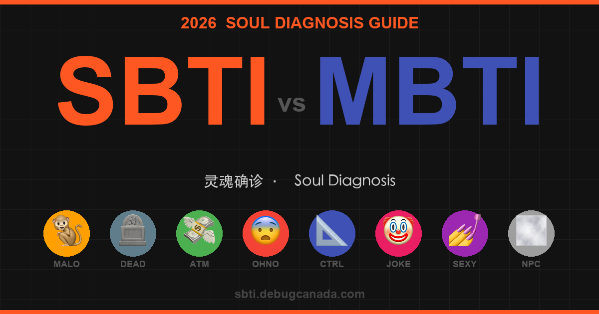

# SBTI 灵魂确诊 · Soul Test

[中文](#中文) | [English](#english)



---

## 中文

> MBTI 已过时。5 道题，确诊你的真实精神状态。

**[🔗 立即体验 → sbti.debugcanada.com](https://sbti.debugcanada.com)**

### 是什么

SBTI（Soul-Based Type Indicator）是一个恶搞版 MBTI 人格测试，用 5 道贴近当代打工人日常的选择题，把你分配到 8 种荒诞人格原型之一。

比起 MBTI 的“你更内向还是外向”，SBTI 问的是：

> 周日晚上 10 点老板艾特你改方案，你第一反应是什么？

### 8 种人格类型

| 类型 | 中文名 | 匹配 MBTI | 一句话定义 |
|------|--------|-----------|-----------|
| 🐒 MALO | 吗喽 | ISFP / INFP | 听劝但命苦，正在猴化中 |
| 🪦 DEAD | 死者 | ISTP / INTJ | 精神已入土，勿扰 |
| 💸 ATM | 送钱者 | ESFJ / ENFJ | 不一定有钱，但总在为别人买单 |
| 😨 OHNO | 哦不人 | ISFJ / INFJ | 脑内已演完 100 种失败 |
| 📐 CTRL | 拿捏者 | ESTJ / ENTJ | 失控会死，什么都想排进表格 |
| 🤡 JOKE | 小丑 | ENTP / ENFP | 把所有痛苦加工成段子 |
| 💅 SEXY | 尤物 | ESFP / ESTP | 地球自转像是在给你打光 |
| 🌫️ NPC | 背景板 | ISTJ / ISFJ | 存在感很低，但世界靠你撑 |

### 技术栈

- 纯原生 HTML / CSS / JavaScript，零依赖、零框架、零构建工具
- ES6 模块化
- 静态部署到 Cloudflare Pages

### 项目结构

```text
sbti/
├── index.html       # 主测试页（中文）
├── index-en.html    # 主测试页（英文）
├── types.html       # 全部类型详情（中文）
├── types-en.html    # 全部类型详情（英文）
├── script.js        # 测试逻辑 + 分享功能
├── data.js          # 题目与人格数据（中英双语）
├── style.css        # 样式（含移动端适配）
├── og-cover.png     # 社交分享封面图
├── robots.txt       # 允许主流 AI 爬虫
├── sitemap.xml      # 站点地图（含 hreflang）
└── llms.txt         # GEO：LLM 站点说明
```

### 功能

- 5 题测试，结果即时呈现，无需注册
- 自动语言检测，支持记忆手动切换偏好
- 分享功能，移动端原生分享，桌面端复制链接，并提供 Twitter / Facebook 按钮
- 移动端优化，响应式断点为 600 / 480 / 360px
- SEO + GEO 完整配置：Open Graph、Twitter Card、JSON-LD、hreflang、`llms.txt`、`robots.txt`
- Google Analytics：`G-NWYNWSLHDD`

### 本地运行

无需安装依赖，直接起一个静态服务器即可：

```bash
# Python
python3 -m http.server 8080

# 或 Node.js
npx serve .
```

访问 `http://localhost:8080`

> 直接双击 `index.html` 会因为 ES6 模块的 CORS 限制报错，需要通过 HTTP 服务访问。

### 部署

本项目部署在 Cloudflare Pages，连接 GitHub 仓库后，推送代码即可自动部署。

```bash
git add .
git commit -m "update"
git push
```

### License

MIT。随便用，欢迎 fork 之后改成你自己的梗测试。

---

## English

> MBTI is outdated. Answer 5 questions and get your actual spiritual diagnosis.

**[🔗 Try it now → sbti.debugcanada.com](https://sbti.debugcanada.com)**

### What It Is

SBTI (Soul-Based Type Indicator) is a parody MBTI-style personality test. With 5 questions based on modern working-life chaos, it sorts you into 1 of 8 absurd personality archetypes.

Instead of asking whether you're introverted or extroverted, SBTI asks:

> Your boss tags you at 10 PM on Sunday and asks for another revision. What's your first reaction?

### 8 Personality Types

| Type | English Name | MBTI Match | Summary |
|------|--------------|------------|---------|
| 🐒 MALO | MALOU | ISFP / INFP | Life's tough but you're tougher, slowly turning into a monkey at your desk |
| 🪦 DEAD | THE DEAD | ISTP / INTJ | Mentally buried. Please do not disturb |
| 💸 ATM | THE ATM | ESFJ / ENFJ | Not necessarily rich, but always paying for everyone else |
| 😨 OHNO | MR. OH-NO | ISFJ / INFJ | Your internal theater has already played 100 failure scenarios |
| 📐 CTRL | THE CTRL | ESTJ / ENTJ | Chaos is unacceptable, and everything belongs in a spreadsheet |
| 🤡 JOKE | THE JOKER | ENTP / ENFP | Processing every bit of pain into jokes |
| 💅 SEXY | THE SEXY | ESFP / ESTP | The Earth seems to rotate just to give you better lighting |
| 🌫️ NPC | THE NPC | ISTJ / ISFJ | Almost invisible, but the world would collapse without you |

### Tech Stack

- Vanilla HTML / CSS / JavaScript with zero dependencies, zero framework, and zero build tooling
- ES6 modules
- Static deployment on Cloudflare Pages

### Project Structure

```text
sbti/
├── index.html       # Main quiz page (Chinese)
├── index-en.html    # Main quiz page (English)
├── types.html       # All type details (Chinese)
├── types-en.html    # All type details (English)
├── script.js        # Quiz logic + sharing
├── data.js          # Question and personality data (bilingual)
├── style.css        # Styles with mobile support
├── og-cover.png     # Social share cover image
├── robots.txt       # Allows major AI crawlers
├── sitemap.xml      # Sitemap with hreflang
└── llms.txt         # GEO notes for LLM crawlers
```

### Features

- 5-question quiz with instant results and no signup
- Automatic language detection with remembered manual preference
- Sharing support: native share on mobile, one-click copy on desktop, plus Twitter / Facebook buttons
- Mobile optimized with responsive breakpoints at 600 / 480 / 360px
- Complete SEO + GEO setup: Open Graph, Twitter Card, JSON-LD, hreflang, `llms.txt`, and `robots.txt`
- Google Analytics: `G-NWYNWSLHDD`

### Local Development

No dependencies are required. Just start any static file server:

```bash
# Python
python3 -m http.server 8080

# or Node.js
npx serve .
```

Open `http://localhost:8080`

> Opening `index.html` directly will fail because of ES6 module CORS restrictions. Serve it over HTTP instead.

### Deployment

This project is deployed on Cloudflare Pages. Once the GitHub repository is connected, every push triggers an automatic deployment.

```bash
git add .
git commit -m "update"
git push
```

### License

MIT. Use it freely, and fork it into your own meme personality test.
